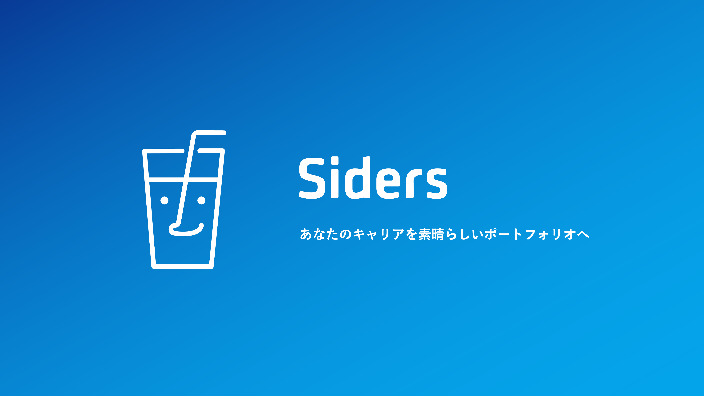

# Siders ポリシー

本リポジトリでは、Siders が提供するサービスに関する以下のポリシーをまとめています。  
- プライバシーポリシー  
- 利用規約  
- 不適切コンテンツ禁止ポリシー  

---

## プライバシーポリシー

**最終更新日：2025年5月17日**

Siders（以下、「当サービス」といいます。）は、本ウェブサイト上で提供するサービス（以下、「本サービス」といいます。）における、ユーザーの個人情報の取扱いについて、以下のとおりプライバシーポリシー（以下、「本ポリシー」といいます。）を定めます。

### 第1条（個人情報）
「個人情報」とは、個人情報保護法にいう「個人情報」を指すものとし、生存する個人に関する情報であって、当該情報に含まれる氏名、生年月日、住所、電話番号、連絡先その他の記述等により特定の個人を識別できる情報及び容貌、指紋、声紋にかかるデータ、及び健康保険証の保険者番号などの当該情報単体から特定の個人を識別できる情報（個人識別情報）を指します。

### 第2条（個人情報の収集方法）
当サービスは、ユーザーが利用登録をする際に以下の情報をお尋ねすることがあります。  
- 氏名  
- 生年月日  
- 住所  
- 電話番号  
- メールアドレス  
- 銀行口座番号  
- クレジットカード番号  
- 運転免許証番号　など  

また、ユーザーと提携先などとの間でなされた取引記録や決済に関する情報を、提携先から収集することがあります。

### 第3条（個人情報を収集・利用する目的）
1. 当サービスの提供・運営のため  
2. ユーザーからのお問い合わせに回答するため（本人確認を含む）  
3. 新機能・更新情報・キャンペーン等のご案内メール送付のため  
4. メンテナンス・重要なお知らせ等の連絡のため  
5. 不正利用者の特定・利用停止のため  
6. 登録情報の閲覧・変更・削除、ご利用状況の確認のため  
7. 有料サービスの利用料金請求のため  
8. 上記に付随する目的のため  

### 第4条（利用目的の変更）
1. 利用目的を変更する場合、変更前と関連性が合理的に認められる場合に限り行います。  
2. 変更後の目的は当サービス所定の方法で通知またはウェブサイト上に公表します。  

### 第5条（個人情報の第三者提供）
1. 以下の場合を除き、ユーザーの同意なく第三者に提供しません。  
   - 人の生命・身体・財産保護のため必要かつ同意取得が困難なとき  
   - 公衆衛生向上または児童健全育成のため必要かつ同意取得が困難なとき  
   - 国や自治体等の公的機関の事務に協力する必要があるとき  
   - あらかじめ所定事項を公表・届出したとき  
2. 利用目的達成のために委託する場合、合併等による事業承継の場合、共同利用の場合は第三者提供に該当しません。  

### 第6条（個人情報の開示）
1. 本人から開示請求があった場合、遅滞なく開示します。ただし以下の場合は一部または全部を開示しないことがあります。  
   - 本人または第三者の生命・身体・財産などを害するおそれがある場合  
   - 当サービスの業務の適正な実施に支障を及ぼすおそれがある場合  
   - 法令に違反する場合  
2. 履歴情報・特性情報等の個人情報以外の情報は原則開示しません。  

### 第7条（個人情報の訂正および削除）
1. ユーザーは誤った個人情報の訂正・追加・削除を請求できます。  
2. 理由があると判断した場合、遅滞なく訂正等を行い、その結果を通知します。  

### 第8条（個人情報の利用停止等）
1. 利用目的を超えて取り扱われている、または不正取得が疑われる場合、利用停止等を請求できます。  
2. 請求が理由あると判断した場合、遅滞なく利用停止等を行い、結果を通知します。  
3. 多額の費用等で困難な場合は代替策を講じます。  

### 第9条（プライバシーポリシーの変更）
1. 法令変更等に応じて、ユーザーへの通知なく変更できるものとします。  
2. 変更後のポリシーはウェブサイト掲載時から効力を生じます。  

### 第10条（お問い合わせ窓口）
- 担当者：前中優里  
- 担当部署：個人情報保護担当  
- Eメール：sidersjapan@gmail.com  

---

## 利用規約

**最終更新日：2025年5月17日**

### 第1条（適用）
本規約は、当サービスが提供する本サービスの利用条件を定めるものです。

### 第2条（利用登録）
1. 本規約に同意の上、当サービス所定の方法で申請・承認を経て完了します。  
2. 虚偽申請や過去違反者などは承認しない場合があります。

### 第3条（ユーザーIDおよびパスワードの管理）
1. ユーザーは自己責任で適切に管理します。  
2. 第三者への譲渡・貸与・共用をしてはなりません。  
3. 当サービスは、正しい組み合わせでのログインを登録ユーザーによる利用とみなします。

### 第4条（利用料金および支払方法）
1. 基本利用は無料です。  
2. 有料サービスは所定の利用料金をお支払いいただきます。  
3. 料金は原則払い戻し不可とします。

### 第5条（禁止事項）
ユーザーは以下の行為をしてはなりません。  
1. 法令・公序良俗違反  
2. 犯罪関連行為  
3. 知的財産権侵害  
4. サーバー・ネットワーク破壊・妨害  
5. 商業利用  
6. 運営妨害  
7. 不正アクセス  
8. 個人情報収集  
9. 不正利用目的  
10. 他者への損害・不快感  
11. 暴力的・脅迫的投稿  
12. 差別・ヘイトスピーチ  
13. 性的・わいせつ性投稿  
14. 違法行為助長  
15. プライバシー侵害投稿  
16. スパム・詐欺  
17. 自傷行為助長  
18. 薬物関連助長  
19. その他不適切と判断する行為  

### 第6条（不適切コンテンツへの対応）
1. 禁止事項に該当する場合、通知なく次の措置を講じます。  
   1. コンテンツ削除  
   2. 警告  
   3. アカウント一時停止  
   4. アカウント永久停止  
   5. その他必要措置  
2. 措置理由の開示義務を負いません。  
3. 監視・削除の完全性や即時性を保証しません。  
4. ユーザーは報告機能で通報できます。  
5. 通報後24時間以内に確認し、必要措置を講じます。  
6. 違反ユーザーには警告やアカウント停止等を行います。

### 第7条（本サービスの提供の停止等）
1. 以下の場合、通知なくサービス提供を停止・中断できます。  
   - システム保守点検・更新  
   - 自然災害等の不可抗力  
   - 通信障害  
   - その他提供困難と判断した場合  
2. 停止・中断による損害について一切責任を負いません。

### 第8条（免責事項）
1. 本サービスに瑕疵がないことを保証しません。  
2. 故意・重過失以外の損害賠償責任を負いません。  
3. 間接損害については一切責任を負いません。

### 第9条（サービス内容の変更等）
ユーザーへの告知をもって、内容変更・追加・廃止が可能です。

### 第10条（利用規約の変更）
ユーザー同意なく変更できる場合：  
1. 一般利益に適合するとき  
2. 契約目的に反せず合理的と認められるとき  

### 第11条（個人情報の取扱い）
本サービスの利用で取得する個人情報は「プライバシーポリシー」に従い取り扱います。

### 第12条（通知または連絡）
通知は当サービス所定の方法で行い、発信時点で到達したものとみなします。

### 第13条（権利義務の譲渡の禁止）
ユーザーは本規約上の地位や権利義務を第三者に譲渡・担保に供してはなりません。

### 第14条（準拠法・裁判管轄）
1. 日本法を準拠法とします。  
2. 紛争は当サービス本店所在地管轄裁判所を専属合意管轄とします。

---

## 不適切コンテンツ禁止ポリシー

**最終更新日：2025年5月17日**

Sidersでは、すべてのユーザーが安心して利用できる健全なコミュニティを維持するため、以下の不適切コンテンツの投稿を禁止します。

### 1. 暴力・脅迫関連
- 暴力的行為の描写・助長  
- 脅迫、恐喝、威嚇  
- テロリズム・過激主義の支持・宣伝  
- 自傷行為・自殺助長  

### 2. 差別・ハラスメント関連
- 人種・民族・宗教・性別・性的指向・年齢・障害等による差別  
- ヘイトスピーチ・中傷  
- いじめ・嫌がらせ・ストーカー行為  
- 個人の尊厳を傷つける内容  

### 3. 性的・わいせつ関連
- 性的に露骨・挑発的な内容  
- ヌード・性的行為の描写  
- 未成年者の性的表現  
- 性的サービスの宣伝・勧誘  

### 4. 違法行為関連
- 違法行為助長・推奨・指示  
- 薬物製造・販売・使用助長  
- 武器・危険物の製造・入手方法説明  
- 詐欺・金融犯罪関連  

### 5. 知的財産権侵害
- 著作権・商標権・肖像権侵害  
- 無断転載・無断画像使用  
- 偽造品・海賊版の宣伝・販売  

### 6. プライバシー侵害
- 他者の個人情報無断公開  
- プライベート会話・画像の無断共有  
- 同意なき撮影画像・動画  

### 7. スパム・詐欺関連
- 同一／類似内容の大量投稿  
- 虚偽情報拡散  
- フィッシング詐欺・マルウェア配布  
- 不正商業活動・投資詐欺  

### 8. その他
- 公序良俗に反する内容  
- 未成年者に有害な内容  
- 運営妨害を目的とした投稿  
- その他当サービスが不適切と判断するもの  

---

### 違反への対応措置
1. **即座の措置**  
   - 該当コンテンツ削除／非表示  
   - アカウント機能制限  

2. **段階的措置**  
   - 初回：警告＋削除  
   - 再違反：アカウント一時停止（7日～30日）  
   - 重大・繰り返し違反：永久停止  

3. **重大違反時の措置**  
   - 法的措置のため関係当局へ通報  
   - 他ユーザーへの危害予想時：即時停止  
   - 組織的違反：関連アカウント調査・措置  

これらは事前通知なく実施され、理由の詳細開示義務を負いません。

---

ご不明点やご意見は、アプリ内のお問い合わせフォームまたは公式ウェブサイトのお問い合わせページよりご連絡ください。  
